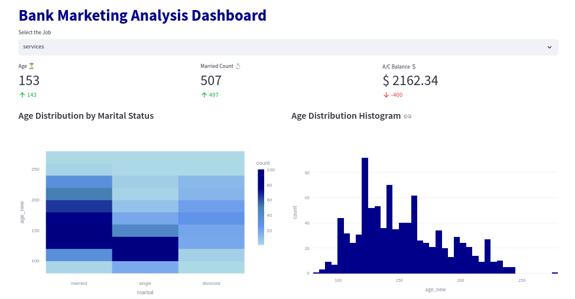

# Bank Marketing Analysis Dashboard Documentation
st.markdown('', unsafe_allow_html=True)
This documentation explains the various components of the Streamlit application used to create a Bank Marketing Analysis Dashboard. The dashboard reads data from a CSV file, processes it, and visualizes key metrics and charts in near real-time.

## Table of Contents

1. [Introduction](#introduction)
2. [Dependencies](#dependencies)
3. [Reading Data](#reading-data)
4. [Dashboard Configuration](#dashboard-configuration)
5. [Filters and Data Manipulation](#filters-and-data-manipulation)
6. [Key Performance Indicators (KPIs)](#key-performance-indicators-kpis)
7. [Visualizations](#visualizations)
8. [Real-Time Simulation](#real-time-simulation)

## Introduction

This Streamlit application provides an interactive dashboard for analyzing bank marketing data. It allows users to filter data by job type and visualizes various metrics and charts that are updated in real-time.

## Dependencies

The following libraries are required to run this application:

- `streamlit`: For web development and dashboard creation.
- `numpy`: For numerical operations such as calculating mean values and generating random numbers.
- `pandas`: For data manipulation and reading CSV files.
- `plotly.express`: For creating interactive charts.
- `time`: For simulating real-time data updates.

## Reading Data

The data is read from a CSV file hosted on GitHub. The dataset contains information on bank marketing campaigns.

```python
df = pd.read_csv("https://raw.githubusercontent.com/Lexie88rus/bank-marketing-analysis/master/bank.csv")
```

## Dashboard Configuration

The dashboard is configured with a title, icon, and wide layout.

```python
st.set_page_config(
    page_title='Bank Marketing Analysis Dashboard',
    page_icon='🏦',
    layout='wide'
)
```

## Filters and Data Manipulation

### Job Filter

A dropdown filter allows users to select a specific job type from the dataset.

```python
job_filter = st.selectbox("Select the Job", pd.unique(df['job']))
df = df[df['job'] == job_filter]
```

### Data Manipulation

New columns are created to simulate real-time changes in the data.

```python
df['age_new'] = df['age'] * np.random.choice(range(1, 5))
df['balance_new'] = df['balance'] * np.random.choice(range(1, 5))
```

## Key Performance Indicators (KPIs)

Three KPIs are calculated and displayed:

1. **Average Age**: The mean value of the `age_new` column.
2. **Married Count**: The count of married individuals in the dataset, with a random variation added.
3. **Average Account Balance**: The mean value of the `balance_new` column.

```python
avg_age = np.mean(df['age_new'])
count_married = int(df[(df["marital"] == 'married')]['marital'].count() + np.random.choice(range(1, 30)))
balance = np.mean(df['balance_new'])
```

These KPIs are displayed in three columns.

```python
kpi1, kpi2, kpi3 = st.columns(3)
kpi1.metric(label="Age ⏳", value=round(avg_age), delta=round(avg_age) - 10)
kpi2.metric(label="Married Count 💍", value=int(count_married), delta=-10 + count_married)
kpi3.metric(label="A/C Balance ＄", value=f"$ {round(balance, 2)}", delta=-round(balance / count_married) * 100)
```

## Visualizations

Two charts are created to visualize the data:

1. **Density Heatmap**: Shows the distribution of `age_new` by `marital` status.
2. **Histogram**: Displays the distribution of `age_new`.

```python
fig_col1, fig_col2 = st.columns(2)
with fig_col1:
    st.markdown("### First Chart")
    fig = px.density_heatmap(data_frame=df, y='age_new', x='marital', range_color=(1, 120))
    st.write(fig)
with fig_col2:
    st.markdown("### Second Chart")
    fig2 = px.histogram(data_frame=df, x='age_new')
    st.write(fig2)
```

A detailed view of the filtered data is also displayed.

```python
st.markdown("### Detailed Data View")
st.dataframe(df)
```

## Real-Time Simulation

The dashboard simulates real-time data updates by looping through a range of seconds, updating the KPIs and visualizations every second.

```python
for seconds in range(200):
    df['age_new'] = df['age'] * np.random.choice(range(1, 5))
    df['balance_new'] = df['balance'] * np.random.choice(range(1, 5))

    avg_age = np.mean(df['age_new'])
    count_married = int(df[(df["marital"] == 'married')]['marital'].count() + np.random.choice(range(1, 30)))
    balance = np.mean(df['balance_new'])

    with placeholder.container():
        kpi1, kpi2, kpi3 = st.columns(3)
        kpi1.metric(label="Age ⏳", value=round(avg_age), delta=round(avg_age) - 10)
        kpi2.metric(label="Married Count 💍", value=int(count_married), delta=-10 + count_married)
        kpi3.metric(label="A/C Balance ＄", value=f"$ {round(balance, 2)}", delta=-round(balance / count_married) * 100)

        fig_col1, fig_col2 = st.columns(2)
        with fig_col1:
            st.markdown("### First Chart")
            fig = px.density_heatmap(data_frame=df, y='age_new', x='marital', range_color=(1, 120))
            st.write(fig)
        with fig_col2:
            st.markdown("### Second Chart")
            fig2 = px.histogram(data_frame=df, x='age_new')
            st.write(fig2)
        st.markdown("### Detailed Data View")
        st.dataframe(df)
        time.sleep(1)
```

The `placeholder` container is used to update the dashboard content dynamically.

```python
placeholder = st.empty()
```

The loop pauses for one second in each iteration to simulate real-time updates.

```python
time.sleep(1)
```
